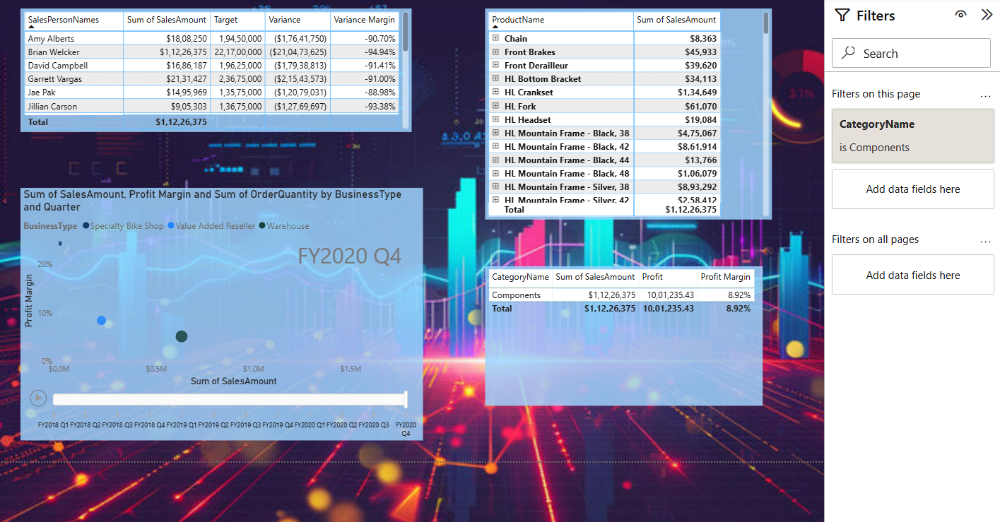
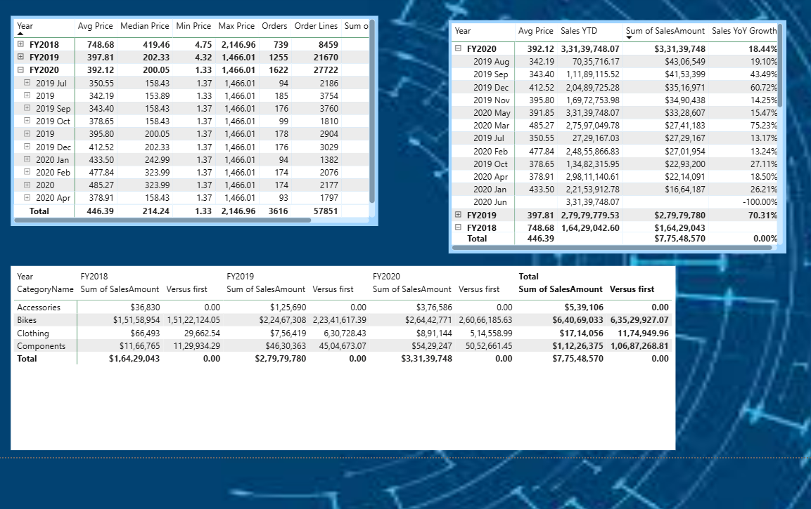
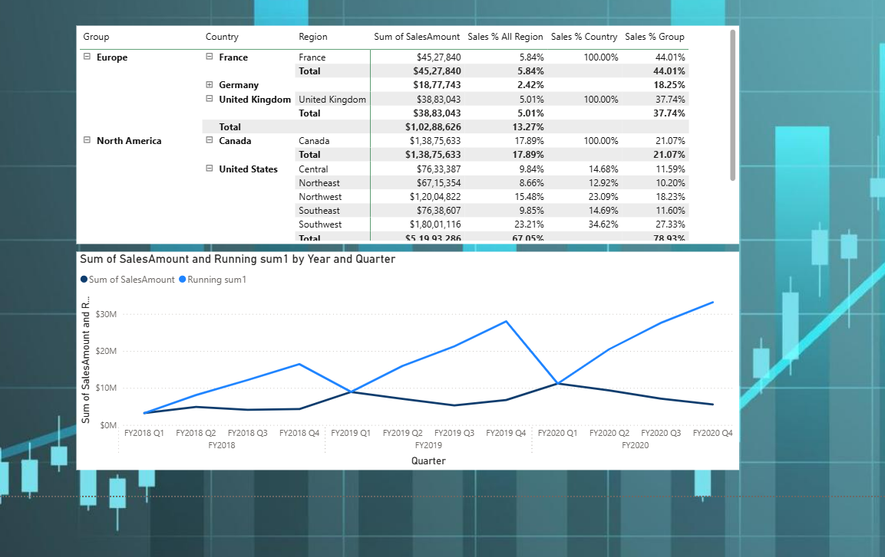
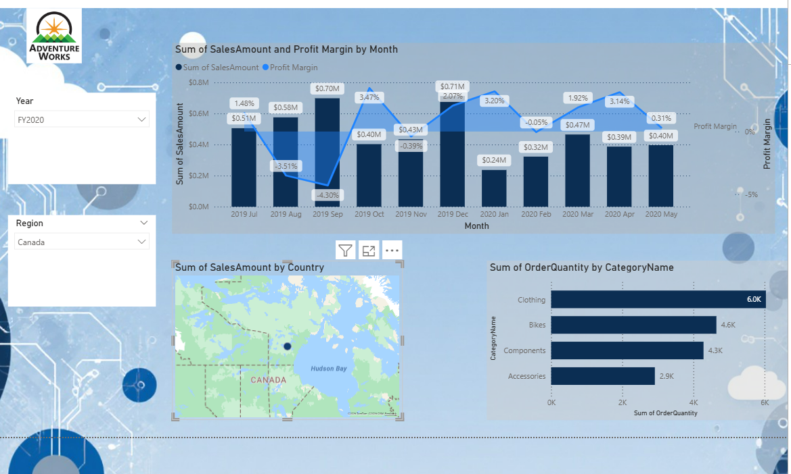
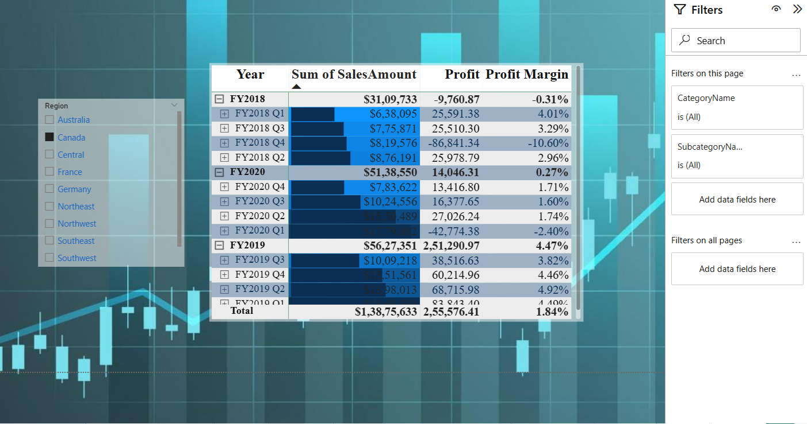
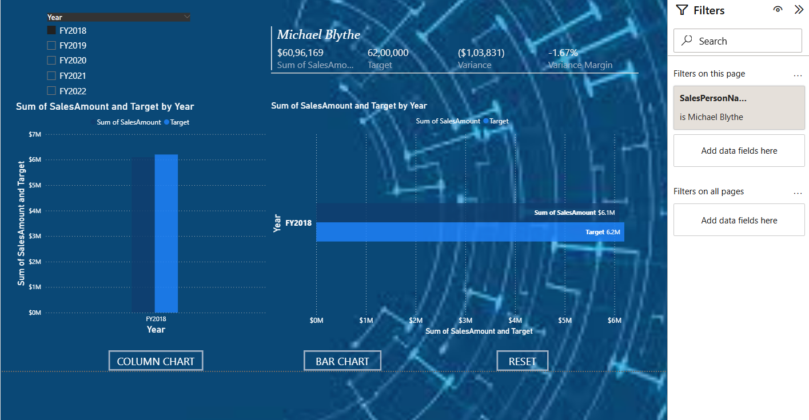
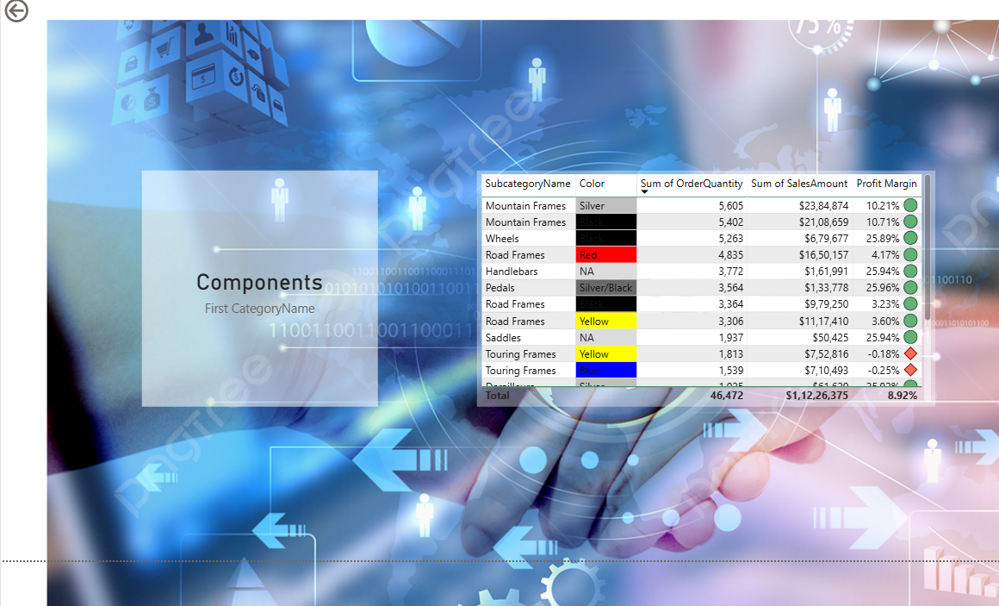
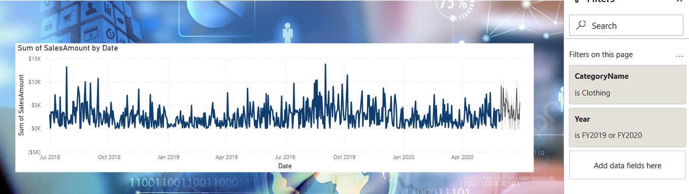
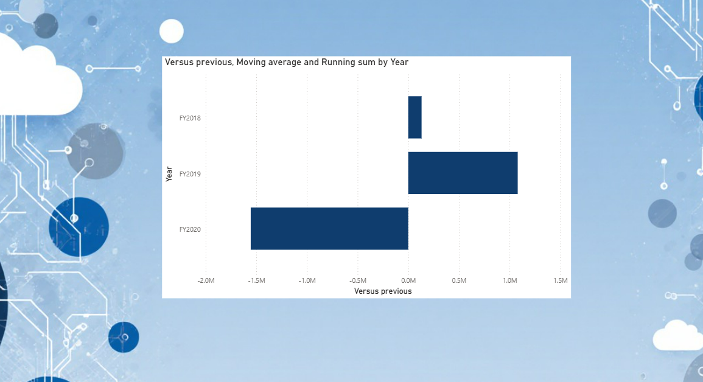

# 📊 Sales Analytics Dashboard 

## 📌 Project Overview

This project presents a comprehensive **Sales Analytics Dashboard built using Power BI**.
The dashboard analyzes business data across multiple perspectives including **revenue insights, regional performance, product analysis, profit margins, salesperson performance, and sales forecasting**.

The goal of this project is to convert raw sales data into **interactive visual insights that help support business decision-making**.

---

# 🛠 Tools & Technologies

* Power BI
* Data Modeling
* DAX (Data Analysis Expressions)
* Data Visualization
* Business Intelligence

---

# 📈 Dashboard Pages

---

# 1️⃣ Scatter Plot

This page visualizes the relationship between **sales amount and profit margin across different business types and quarters**.

Key Insights:

* Sales vs Profit Margin comparison
* Business type performance analysis
* Quarterly trend visualization

---

# 2️⃣ Revenue & Sales Insights

This section analyzes sales performance across fiscal years using detailed sales metrics.

Key Metrics:

* Average Price
* Median Price
* Minimum & Maximum Price
* Total Orders and Order Lines
* Sales Year-to-Date (YTD)
* Sales Year-over-Year Growth

---

# 3️⃣ Sales Analysis by Region

This page explores **sales distribution across regions and countries**.

Key Insights:

* Regional contribution to total revenue
* Country-level sales analysis
* Sales percentage comparison by region
* Running total sales trend

---

# 4️⃣ Overview

This page provides a **high-level business overview dashboard**.

Key Insights:

* Monthly sales trends
* Profit margin analysis
* Regional sales distribution
* Order quantity by product category

---

# 5️⃣ Profit

This page analyzes **profit performance across fiscal years and quarters**.

Key Insights:

* Profit margin trends
* Quarterly profitability
* Revenue vs profit analysis

---

# 6️⃣ Sales Person Performance

This page evaluates **individual salesperson performance compared with targets**.

Key Metrics:

* Sales achieved vs target
* Variance analysis
* Individual contribution to total sales

---

# 7️⃣ Product Details

This page analyzes **product-level sales performance**.

Key Insights:

* Sales by product category
* Order quantity analysis
* Profit margin by product
* Product variation analysis

---

# 8️⃣ Forecast

This section performs **sales forecasting based on historical data trends**.

Key Insights:

* Historical sales patterns
* Predicted future sales
* Seasonal sales fluctuations

---

# 9️⃣ Annual Revenue Comparison

This page compares **year-over-year revenue performance**.

Key Insights:

* Year-over-year revenue growth
* Moving average trend analysis
* Running total sales performance

---

# 📊 Key Business Insights

* North America contributes a significant portion of total revenue.
* Certain product categories generate higher sales and profitability.
* Sales trends indicate seasonal fluctuations across fiscal quarters.
* Forecast analysis helps anticipate future sales demand.

---

# 🎯 Conclusion

This Power BI dashboard demonstrates how **data visualization and business intelligence tools can transform raw datasets into actionable insights**.
The dashboard supports organizations in **monitoring performance, identifying growth opportunities, and making strategic decisions**.

---

# 📬 Contact

**Deepti Suresh**
Aspiring Data Analyst

📧 [deeptisuresh05@gmail.com](mailto:deeptisuresh05@gmail.com)

---
